# CS 2240 - Operating Systems

**Date:** 8/25/2025  

---

## Lecture 1: Bruce Bolden – Intro to Operating Systems
**Contact:** JEB 232 · [bruceb@uidaho.edu](mailto:bruceb@uidaho.edu)

### Operating System
- Uses the hardware resources of one or more processors  
- Provides a set of services to system users  
- Manages secondary memory and I/O devices  

### Basic Elements
- **Processor**
- **Main Memory**
  - Volatile
  - Referred to as real memory or primary memory
- **I/O Modules**
  - Secondary memory devices
  - Communications equipment
  - Terminals
- **System Bus**
  - Communication among processors, memory, I/O modules  

### Processor
- **Internal Registers**
  - Memory Address Register (MAR)  
    - Specifies the address for the next read or write  
  - Memory Buffer Register (MBR)  
    - Contains data written into memory or receives data read from memory  
  - I/O Address Register  
  - I/O Buffer Register  

### Processor Registers
- **User-Visible Registers**
  - Enable programmer to minimize main-memory references by optimizing register use
- **Control and Status Registers**
  - Used by processor to control operation
  - Used by privileged OS routines to control program execution  

### User-Visible Registers
- May be referenced by machine language  
- Available to all programs (application + system)  

**Types of Registers:**
- Data  
- Address  
  - Index  
  - Segment pointer  
  - Stack pointer  

**Address Registers:**
- **Index** – Adds an index to a base value to get an address  
- **Segment Pointer** – Memory divided into segments; referenced by segment + offset  
- **Stack Pointer** – Points to top of stack  

**Control and Status Registers:**
- Program Counter (PC) – Address of instruction to be fetched  
- Instruction Register (IR) – Instruction most recently fetched  
- Program Status Word (PSW)  
  - Condition codes  
  - Interrupt enable/disable  
  - Supervisor/user mode  
- Condition Codes or Flags  
  - Bits set by hardware after operations  
  - Examples: Positive, Negative, Zero, Overflow  

### Instruction Execution
- Two steps:  
  1. Fetch instruction from memory  
  2. Execute instruction  

### Instruction Fetch and Execute
- Processor fetches from memory  
- PC holds address of next instruction  
- PC increments after each fetch  

### Instruction Register
- Holds fetched instruction  

**Categories:**
- Processor-memory – Transfer data between CPU and memory  
- Processor-I/O – Transfer data to/from peripheral  
- Data Processing – Arithmetic/logic on data  
- Control – Alters execution sequence  

---

## Lecture 2: Overview

### Instruction Cycle
- START → Fetch Instruction → Execute Instruction → (until HALT)  
- Execution alternates between **Fetch Stage** and **Execute Stage**

### Instruction Fetch & Execute
- Processor fetches from memory  
- PC holds next instruction address  
- PC increments after each fetch  
- Instruction placed in Instruction Register  

**Categories:**
- Processor-memory  
- Processor-I/O  
- Data processing  
- Control  

### Interrupts
- Interrupts normal sequencing  
- Needed because I/O devices are slower than processor  
- Processor must pause to wait  

#### Classes of Interrupts
- **Program** – Errors (overflow, divide by zero, illegal instruction, memory violation)  
- **Timer** – Generated by processor timer for periodic OS tasks  
- **I/O** – Generated by I/O controller (completion or error)  
- **Hardware Failure** – e.g., power failure, memory parity error  

### Interrupt Handling
- **Interrupt Handler** – OS routine to service device  
- **Interrupts** – Suspend execution, transfer control  
- **Interrupt Cycle**  
  - Check for interrupts  
  - If none → fetch next instruction  
  - If pending → suspend program, run handler  

**Diagrams:**  
- 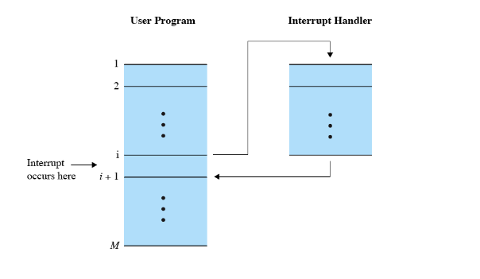  
- 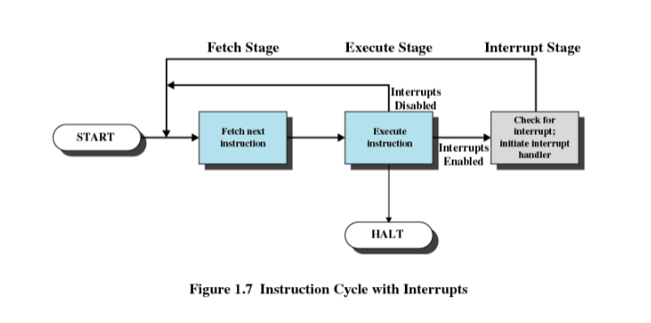  
- 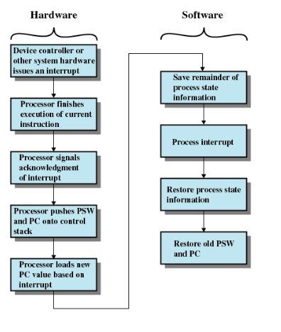  
- 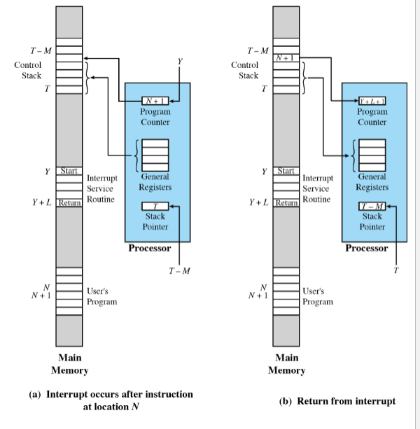  
- 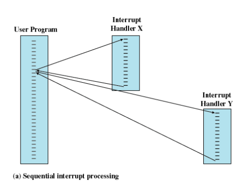  
- 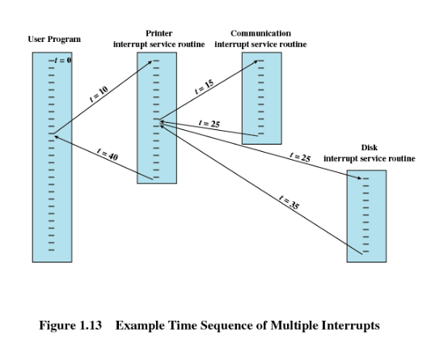  
- 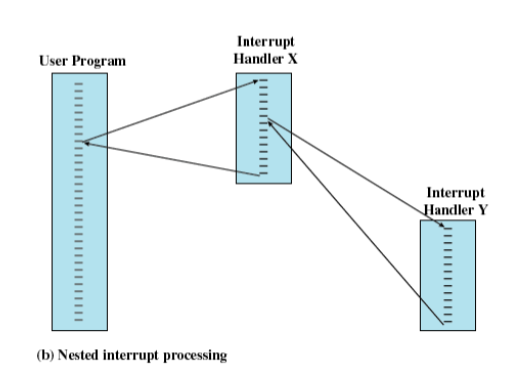  

**Discussion:**  
What issues might arise when testing or verifying correctness of user-defined interrupts?  

---

### Multiprogramming
- Processor executes multiple programs  
- Execution order depends on priority and I/O waiting  
- After interrupt handling, may not resume same program  

---

### Memory Hierarchy
- **Trade-offs:** Faster = more expensive, Slower = cheaper  
- 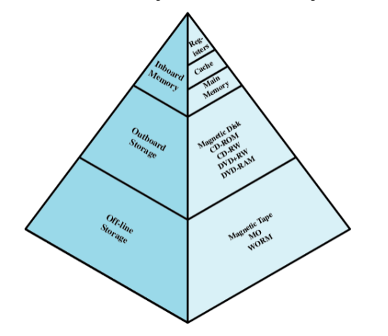

**Hierarchy Trends:**
- Down the hierarchy:  
  - ↓ Cost per bit  
  - ↑ Capacity  
  - ↑ Access time  
  - ↓ Frequency of processor access  

**Details:**
- **Secondary Memory** – Nonvolatile, auxiliary, stores programs/data  
- **Disk Cache**  
  - Main memory buffer for disk  
  - Clustered writes  
  - Faster re-access from cache vs disk  
- **Cache Memory**  
  - Hidden from user/OS  
  - Matches faster CPU speed  
  - Exploits locality  
  - 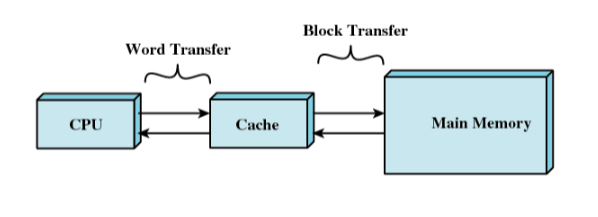  
  - Processor checks cache first, otherwise fetches from main memory  
  - 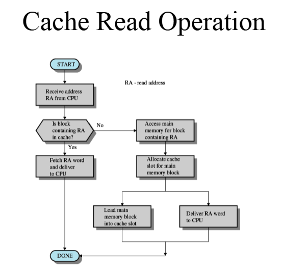  

**Cache Design:**
- Cache size – small caches still impactful  
- Block size – affects hit rate and eviction probability  
- Mapping function – decides block location in cache  
- Replacement algorithm – e.g., Least Recently Used (LRU)  
- Write policy – when memory write occurs (on update vs on replacement)  

---

### Programmed I/O
- I/O module executes action, not CPU  
- Status register updated  
- No interrupts – CPU must poll status until complete  
- Known as **polling**  
- 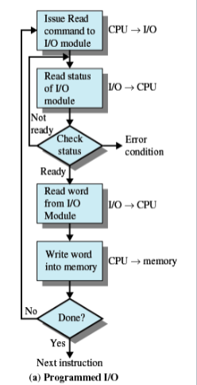  

---

### Interrupt-Driven I/O
- Processor interrupted when I/O module ready to exchange data  
- Processor saves context of executing program and begins interrupt-handler  
- Eliminates needless waiting  
- Still consumes processor time because **every word read/written passes through processor**  
- 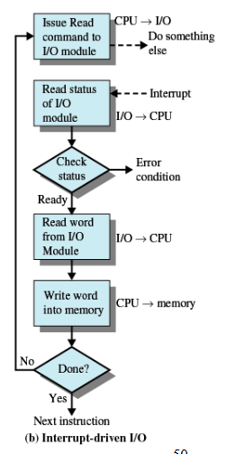

---

### Direct Memory Access (DMA)
- I/O exchanges occur directly with memory  
- Processor grants I/O module authority to read/write memory directly  
- Relieves processor of data transfer responsibility  

**DMA Transfers:**
- Transfers a block of data directly between memory and device  
- Interrupt sent when transfer completes  
- Processor continues other work during transfer  
- 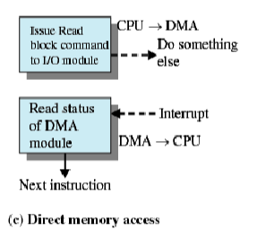