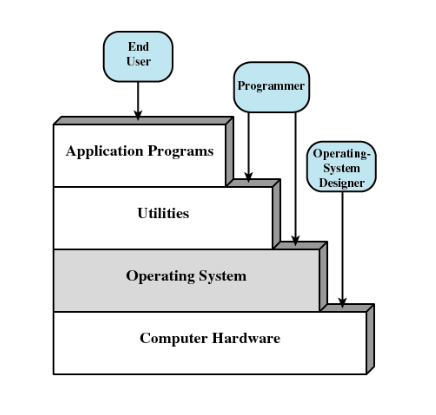
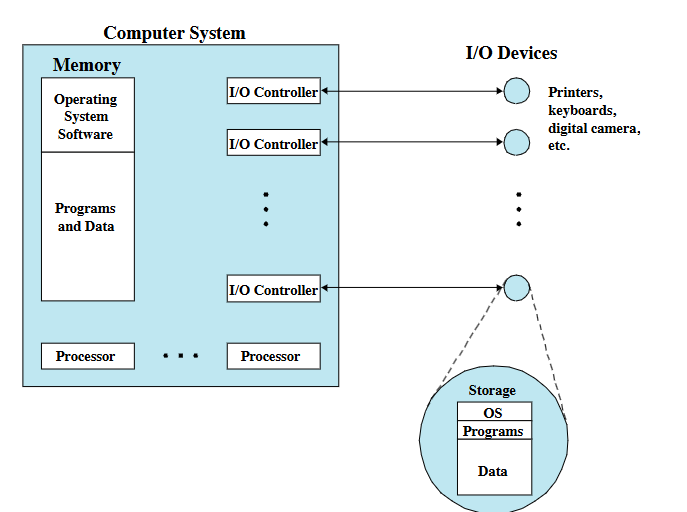
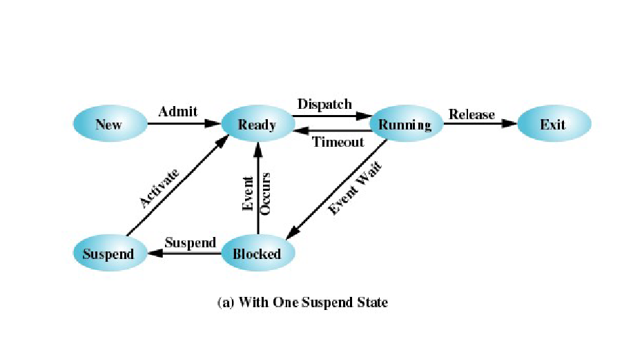
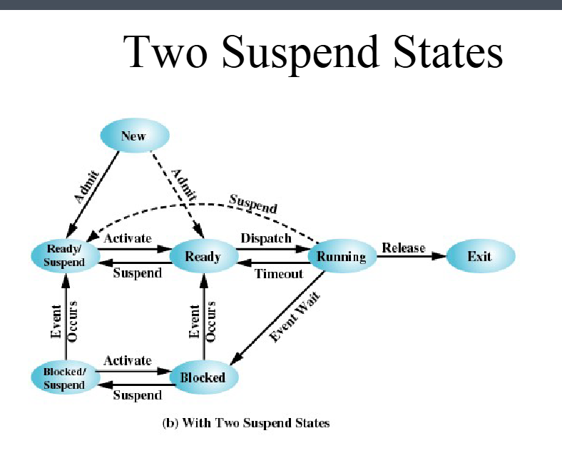
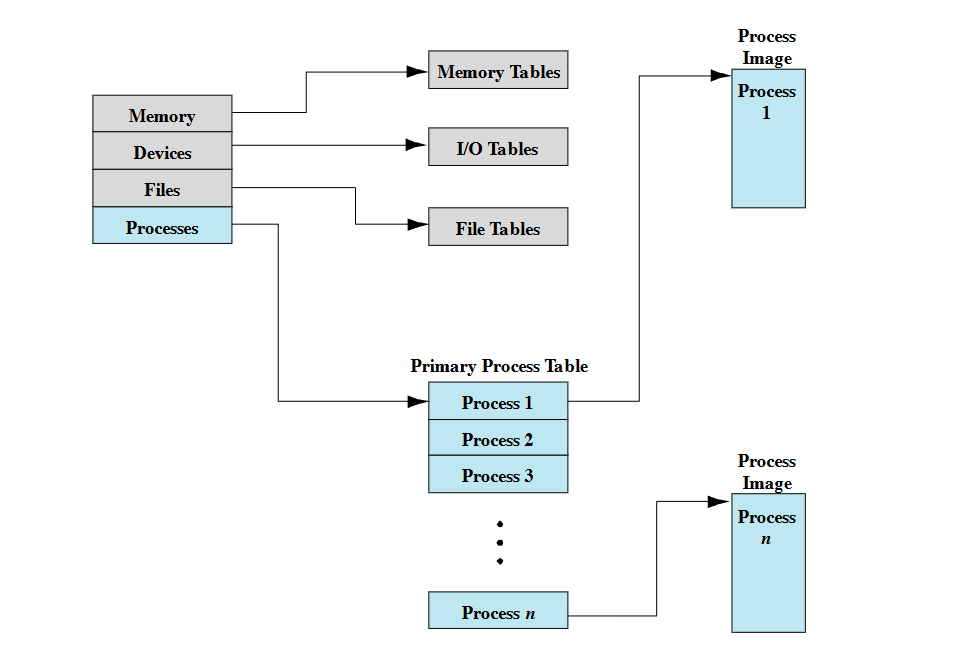
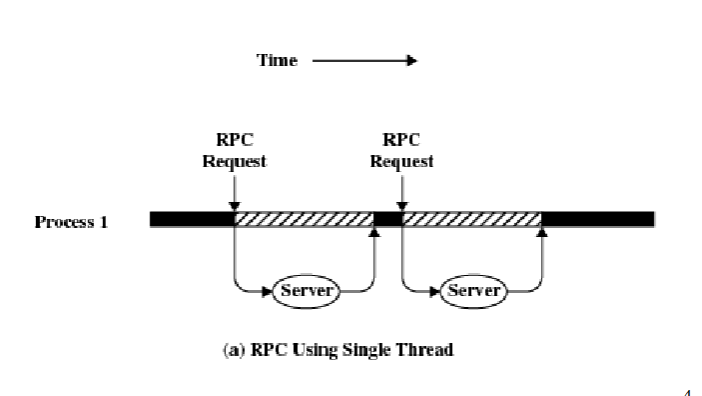
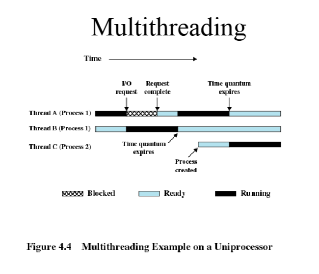
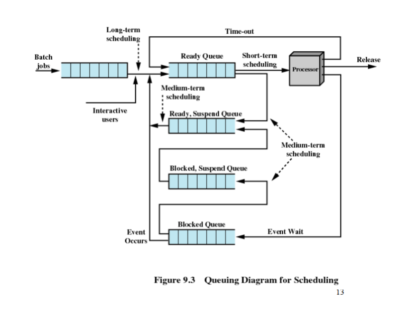

# CS 2240 - Operating Systems

**Date:** 8/25/2025  

---

## Lecture 1: Bruce Bolden – Intro to Operating Systems
**Contact:** JEB 232 · [bruceb@uidaho.edu](mailto:bruceb@uidaho.edu)

### Operating System
- Uses the hardware resources of one or more processors  
- Provides a set of services to system users  
- Manages secondary memory and I/O devices  

### Basic Elements
- **Processor**
- **Main Memory**
  - Volatile
  - Referred to as real memory or primary memory
- **I/O Modules**
  - Secondary memory devices
  - Communications equipment
  - Terminals
- **System Bus**
  - Communication among processors, memory, I/O modules  

### Processor
- **Internal Registers**
  - Memory Address Register (MAR)  
    - Specifies the address for the next read or write  
  - Memory Buffer Register (MBR)  
    - Contains data written into memory or receives data read from memory  
  - I/O Address Register  
  - I/O Buffer Register  

### Processor Registers
- **User-Visible Registers**
  - Enable programmer to minimize main-memory references by optimizing register use
- **Control and Status Registers**
  - Used by processor to control operation
  - Used by privileged OS routines to control program execution  

### User-Visible Registers
- May be referenced by machine language  
- Available to all programs (application + system)  

**Types of Registers:**
- Data  
- Address  
  - Index  
  - Segment pointer  
  - Stack pointer  

**Address Registers:**
- **Index** – Adds an index to a base value to get an address  
- **Segment Pointer** – Memory divided into segments; referenced by segment + offset  
- **Stack Pointer** – Points to top of stack  

**Control and Status Registers:**
- Program Counter (PC) – Address of instruction to be fetched  
- Instruction Register (IR) – Instruction most recently fetched  
- Program Status Word (PSW)  
  - Condition codes  
  - Interrupt enable/disable  
  - Supervisor/user mode  
- Condition Codes or Flags  
  - Bits set by hardware after operations  
  - Examples: Positive, Negative, Zero, Overflow  

### Instruction Execution
- Two steps:  
  1. Fetch instruction from memory  
  2. Execute instruction  

### Instruction Fetch and Execute
- Processor fetches from memory  
- PC holds address of next instruction  
- PC increments after each fetch  

### Instruction Register
- Holds fetched instruction  

**Categories:**
- Processor-memory – Transfer data between CPU and memory  
- Processor-I/O – Transfer data to/from peripheral  
- Data Processing – Arithmetic/logic on data  
- Control – Alters execution sequence  

---

## Lecture 2: Overview

### Instruction Cycle
- START → Fetch Instruction → Execute Instruction → (until HALT)  
- Execution alternates between **Fetch Stage** and **Execute Stage**

### Instruction Fetch & Execute
- Processor fetches from memory  
- PC holds next instruction address  
- PC increments after each fetch  
- Instruction placed in Instruction Register  

**Categories:**
- Processor-memory  
- Processor-I/O  
- Data processing  
- Control  

### Interrupts
- Interrupts normal sequencing  
- Needed because I/O devices are slower than processor  
- Processor must pause to wait  

#### Classes of Interrupts
- **Program** – Errors (overflow, divide by zero, illegal instruction, memory violation)  
- **Timer** – Generated by processor timer for periodic OS tasks  
- **I/O** – Generated by I/O controller (completion or error)  
- **Hardware Failure** – e.g., power failure, memory parity error  

### Interrupt Handling
- **Interrupt Handler** – OS routine to service device  
- **Interrupts** – Suspend execution, transfer control  
- **Interrupt Cycle**  
  - Check for interrupts  
  - If none → fetch next instruction  
  - If pending → suspend program, run handler  

**Diagrams:**  
-   
-   
-   
-   
-   
-   
-   

**Discussion:**  
What issues might arise when testing or verifying correctness of user-defined interrupts?  

---

### Multiprogramming
- Processor executes multiple programs  
- Execution order depends on priority and I/O waiting  
- After interrupt handling, may not resume same program  

---

### Memory Hierarchy
- **Trade-offs:** Faster = more expensive, Slower = cheaper  
- 

**Hierarchy Trends:**
- Down the hierarchy:  
  - ↓ Cost per bit  
  - ↑ Capacity  
  - ↑ Access time  
  - ↓ Frequency of processor access  

**Details:**
- **Secondary Memory** – Nonvolatile, auxiliary, stores programs/data  
- **Disk Cache**  
  - Main memory buffer for disk  
  - Clustered writes  
  - Faster re-access from cache vs disk  
- **Cache Memory**  
  - Hidden from user/OS  
  - Matches faster CPU speed  
  - Exploits locality  
  -   
  - Processor checks cache first, otherwise fetches from main memory  
  -   

**Cache Design:**
- Cache size – small caches still impactful  
- Block size – affects hit rate and eviction probability  
- Mapping function – decides block location in cache  
- Replacement algorithm – e.g., Least Recently Used (LRU)  
- Write policy – when memory write occurs (on update vs on replacement)  

---

### Programmed I/O
- I/O module executes action, not CPU  
- Status register updated  
- No interrupts – CPU must poll status until complete  
- Known as **polling**  
-   

---

### Interrupt-Driven I/O
- Processor interrupted when I/O module ready to exchange data  
- Processor saves context of executing program and begins interrupt-handler  
- Eliminates needless waiting  
- Still consumes processor time because **every word read/written passes through processor**  
- 

---

### Direct Memory Access (DMA)
- I/O exchanges occur directly with memory  
- Processor grants I/O module authority to read/write memory directly  
- Relieves processor of data transfer responsibility  

**DMA Transfers:**
- Transfers a block of data directly between memory and device  
- Interrupt sent when transfer completes  
- Processor continues other work during transfer  
- 

## Lecture 2 cout.
### Operating System Objectives
- Convenience
  - Makes the computer more convenient to use
- Efficiency
  - Allows computer system resources to be used
in an efficient manner
- Ability to evolve
  - Permit effective development, testing, and
introduction of new system functions
without interfering with service

### Layers of Computer systems

- 

### Services Provided by the **Operating System**
- Program development
- Editors and debuggers
- Program execution
- Access to I/O devices
- Controlled access to files
- Memory management
- System access
- Network support
- Error detection and response
  - Internal and external hardware errors
    - Memory error
    - Device failure
  - Software errors
    - Arithmetic overflow
    - Access forbidden memory locations
  - Operating system cannot grant request of
  application
- Accounting
  - Collect usage statistics  
  - Monitor performance
  - Used to anticipate future enhancements
  - Used for billing purposes
  - Check out the log files of a Unix system
    - Where do you find this information?
### **Operating System**
- Responsible for managing resources
An OS is just a program that is executed
- 
### **Kernel**
- Portion of operating system that is in main
memory
- Contains most frequently used functions
Also called the nucleus

### Time Sharing
- Using multiprogramming to handle multiple interactive job
- Processor's time is shared among multiple users
- Multiple users simultaneously access the system through terminals

## Modern Operating systems

- Features
  - Micro Kernel architecture
    - Assigns only a few essential functions to the kernel
      - address spaces
      - interproccesses
  - Multithreading 
    - Process is divided into threads that can run concurrently
      - Thread
        - dispatchable unit of work
        - executes sequentially and is interruptables
  - Symmetric Multiprocessing 
     - There are multiple processors
     - these share the same main memory
     - all processors cab perform the same functions
  - Distributed OPerating Systems
    - 
    - 
    - 
  - Object-Oriented Design

## Kernel
- memory
- i/o
- hardware abstraction layer
- device drivers
  - low level user request -> i/o calls
- windowing and graphical user interface

## Windows executive 
- i/o manager
- cache manager
- object manager
- plug and play manager
- power manager
- security reference monitor
- virtual memory manager
- process/thread manager
- config manager
- local procedure call (LPC) facility

## User-Mode Processes 
- Special system support processes
  - logon process and the session manager
- service processes
- env subsystems
- user applications

## Client Server model
- Simplifies the Executive
  - Possible to construct a variety of APIs
- Improves reliability
  - each service runs on a separate process with its own partition of memory
  - clients cannot not directly access hardware
- Provides a uniform mechanism for applications to communicate via LPC
- Provides base for distributed computing 

## Threads and SMP
- Operating system routines can run on any available processor
- Different routines can execute simultaneously on different processors 
- Multiple threads of execution within a single process may execute on different processors simultaneously 
- Server processes may use multiple threads 
- Share data and resources between process

## Windows Objects
- Encapsulation 
  - Object consists of one or more data items and one or more procedures 
- Object Class or instance
  - Create 
## UNIX
- Hardware is surrounded by the operating system software
- Operating system is called the system kernel
- Comes with a number of user services and interfaces
  - SHELL
  - Components of the C compiler


## Scheduling and Resource Management 
- Fairness
  - Give equal and fair access to resources 
- Differential responsiveness
  - ...but, OS also needs to discriminate among different classes of jobs
- Efficiency 
  - Maximize throughput, minimize response time, and accommodate as many uses as possible

## System structure
- View the system as a series of levels
- Each level performs a related subset of functions
- Each level relies on the next lower level to perform more primitive functions
- This decomposes a problem into a number of more manageable sub-problems
- a system is just a problem solving system

## Process hardware levels
- Level 1
  - Lowest 
  - electronic circuits
  - objects are registers, memory cells, and logic gates
  - operations are clearing a register or reading a memory location
- Level 2
  - Processor's instruction set 
  - operations such as add, subtract, load, and store
- Level 2
  - Adds the concept of a procedure or subroutines, plus calls/return ops
- Level 4
  - Interrupts
- Level 5
  - Process as a program in execution
  - Suspend and resume processes
- Level 6
  - Secondary storage devices
  - Transfer a block of data
- Level 7
  - Creates Logical

## Requirements of an operating system 
- Interleave the execution of multiple processes to maximize processor utilization while providing reasonable response time
  - Resources made available to multiple applications
  - Processors switch between multiple applications
  - The processor and I/O devices can be used efficiently
- Allocate resources to processes
  - Process is a program in a execution
  - It is also an instance of a program running on a computer
  - it is also the entity that can be assigned to and executed on a processor 
  - it is also a unit of activity characterized by the execution of a sequence of instructions, a current state and an associated set of system instructions
  - Process Elements:
    - identifier
    - state
    - priority
    - program counter
    - memory pointer
    - context data
    - I/O status information
    - Accounting Information
  - Process Control Block 
    - Contains the process elements
    - Create and manage by the operating system
    - Allows support for multiple processes
  - Support interproccesses communication and user creation of processes
  - Trace of Process
    - Sequence of instructions that execute for a process
    - A dispatcher switches the processor from one process to another
## Processes
### Process models
- Two State process model
  - Process may be in one of two states:
    - Running 
    - Not-running
- Not-Running Process in a queue
  - Enters > queue > dispatch > processor > pause > queue > repeat until exit

### Process Creation
- New batch job
  - the operating system is provided with a batch job control stream, usually on a tape or disk. When the os
  is prepared to take on new work, it will read the next sequence of job control commands
- Interactive log on 
  - a user at a terminal logs onto the system
- Created by the OS to provide a service
  - the os can create something to do some work for the program without the user having to wait (printing etc)
- Spawned by existing processes
  - For the purposes of modularity or to exploit parallelism, a user program can dictate the creation of a number of processes

### Process Termination
- Normal completion
- Time limit exceeded
- Memory unavailable 
- Bounds violation
- Protection Error
- Arithmetic Error
- Time overrun
- I/O failure
- Invalid Instruction
- Privileged Instruction
- Data Misuse
- Operator or OS Intervention
- Parent Termination
- Parent request 

### 5 state model
- states
  - running
  - ready
  - blocked
  - new
  - exit

- steps
  - admission into memory (queue)
  - take it off and dispatch to running
    - if it finishes, exit
    - else, timeout back to queue
    - else if event wait, then blocked, if timeout, to queue

### Two queues
- You can use a ready queue and a blocked queue in the 5 state model

### Suspended Processes
- Processor is faster that I/O so all processes could be waiting for I/O
- Swap these processes to disk to free up more memory 
- Blocked state becomes suspend state when swapped to the disk
- Two new states:
  - Blocked/Suspend
  - Ready/Suspend
- suspend models
- 
- 
- Reasons for process suspension
  - swapping
  - other os reason (if the process is causing issues)
  - interactive user request
  - timing
  - parent process request

### Process Description
- The os controls events with the system, It:
  - schedules and dispatches processes for execution by the processor
  - allocates resources to processor
  - responds to requests by user processes for basic services
- Fundamentally, we can think of the OS as that entity that manages the use of the system resources
- OS Control Structures
  - Information about the current status of each process and resource
  - Tables are constructed for each entity the operating system manages

### OS Tables
  - 
  - Memory Tables
    - Memory tables keep track of:
      - allocation of main memory to processes
      - allocation of secondary memory to processes
      - protection attributes for access to shared memory regions
      - information needed to manage virtual memory
  - I/O Tables
    - used by os to keep track of I/O info
  - File Tables
    - keep track of :
      - existence of files
      - location on secondary memory
      - current status
      - attributes
      - sometimes this information is maintained by a file management system
  - Process Table
    - Manage processes
      - where they are located
      - attributes in the process control block
        - program
        - data
        - stack
### Process Image
- user data
  - the modifiable part of the user space; may include program data, a user stack area, and programs that may be modified
- user program
  - the program to be executed (usually in binary)
- system stack
- process control block

### Process Control Block 
- **PID (process identification)**
  - identifiers
    - numeric ids that may be stored with the process control block
      - id of the process
      - id of the process that created this process (parent)
      - user id
- **Process State information**
  - user-visible registers
    - a user-visible register is one that may be referenced by means of the machine lang that the processor executes while in user mode. Typically, there are from 8-32 of these registers, although some RISC implementations have over 100
  - Control and status registers
    - the are several processor registers that are employed to control the operation of the processor:
      - Program counter
      - condition codes
        - sign, zero, carry, equal, overflow, ect...
      - status info
        - interrupt info, flags, exe mode
  - Stack Pointers 
    - each process has one or more last-in-first-out (LIFO) system stacks associated with it
    - A stack is used to store params and calling addresses for procedure and system calls
    - The stack pointer points to the top of the stack
- **Process Control Info**
  - Scheduling and state info
  - this info is needed by the OS to preform its scheduling function
    - Process State
      - defines the readiness of the process to be scheduled for execution
        - running, ready, waiting, halted
    - Priority
      - one or more fields may be used to describe the scheduling priority of the process
      - example values: default, current, highest-allowable
    - Scheduling-related info
      - this will depend on the scheduling algorithm used. 
      - Examples:
        - amount of time the process has been waiting 
        - amount of time the process executed the last time it was running
    - Event
      - Identity of the event the process is awaiting before it can be resumed
  - Data Structuring 
    - a process may be linked to other processes in a queue, ring, or some other structure
    - the process control block can contain pointers to other processes to support structures like parent child relationships
  - Interprocess Communication
    - various flags, signals, and messages may be associated with communication between two independent processes. Some or all of this info may be maintained in the PCB
  - Process Privileges 
    - Processes can be granted privileges
  - Memory Management
    - pointers to segment/page tables that describe the virtual memory assigned to the process
  - Resources Ownership and Utilization
    - Resources controlled by the process may be indicated, such as opened files. A history of utilization of the processor or other resources may also be included; this information may be needed by the scheduler
    
## Threads
- Threads are contained in processes
- They contain some information
  - an execution state (running, ready, etc.)
  - a saved thread context when not running
    • may view a thread as an independent program counter operating within a process
  - an execution stack
  - some per-thread static storage for local variables
  - access to the memory & resources of its process

### Thread States
- **Spawn**
  - when process is spawned
  - thread may spawn other threads
  - each thread has its own:
    - register context, state space, and place in ready queue
- **Block**
  - when thread waits for event
  - saves user registers, PC and stack pointer
- **Unblock**
  - when blocking event occurs
  - thread is moved to ready queue
- **Finish**
  - register context and stack is deallocated

### Remote Procedure Call
- database 
- money transactions
- apis
- 

### Multithreading with multi processes
- 

### ULT over KLT
- Threads switching does not require kernel mode privileges in ult
  - saves two mode switches
- Application specific scheduling
  - applications may prefer their own specific scheduling algorithm
- ULT can run on any OS

### Bad things about ULT
- Many OS sys calls are blocking
  - so if ult exe such call, all threads within its process are blocked
- in a pure ult strategy, a multithreading app cannot take advantage of multiprocessing
  - no concurrency

## Windows
### Windows Processes
- Implemented as objects
- An executable process may contain one or more threads
- Both processes and thread objects have built-in synchronization capabilities

### Windows Process Object
- Object Type
  - PID
  - Security Descriptor
  - Base priority
  - Default processor affinity
- Object Body Attributes
  - Quota limits
  - Execution time
  - I/O counters
  - VM operation counters
  - Exception/debugging ports
  - Exit Status
- Services
  - Create/Open/Query/Terminate

### Windows Thread Object
- Object Type
  - Thread ID
  - Thread Context
  - Dynamic priority
  - Base priority
  - Default processor affinity
- Object Body Attributes
  - thread data 
- Services
  - Create/Open/Query/Terminate/Current Thread
  - other info

### Windows 2000 Thread States
- Runnable
  - Ready
  - Standby
  - Running
- Not Runnable
  - Waiting
  - Transition
  - Terminated

### Solaris
- Process includes the users address space, stack, and PCB
- User-level threads
- Lightweight processes (threads)
- Kernel threads

### Linux Task Data Structure
- State
- Scheduling Information
- Identifiers
- Interprocess communication
- links
- times and timers
- ...other

### Linux States of a Process
- Running 
- Interruptable
- Uninterruptible
- Stopped
- Zombie


## Concurrency: Mutual Exclusion 
### Central OS Design Themes
- Multiprogramming
  - management of multiple processes within a uniprocessor system
- Multiprocessing
  - management of multiple processes within a multiprocessor
- Distributed processing
  - management of multiple processes executing on multiple, distributed computer systems. 
  - Clusters are a prime example of this type of system.

### Concurrency
- critical section
  - a section of code within a process that requires access to shared resources and which may not be executed while another process is in a corresponding section of code
- deadlock
  - a situation in which two or more processes are unable to proceed because each is waiting for one of the others to do something
- livelock
  - A situation in which two or more processes continuously change their state in response to other processes without doing anything useful
- mutual exclusion
  - The requirement that when one process is in a critical section that accesses shared resources, no other processes may be in critical section that accesses any of those shared resources
- race condition
  - a situation in which multiple threads or processes read/write a shared data item, and the final result is dependent on the timing
- starvation
  - runnable processes are overlooked indefinitely by the schedular; although it is able to proceed, it is never chosen

### Difficulties of Concurrency
- Sharing of global resources
- Operating system managing the allocation of resources optimally
- Difficult to locate programming errors

### Currency
- Communication among processes
- Sharing resources
- sync of multiple processes
- Allocation of processor time

### Concurrency
- Multiple applications
  - multiprogramming
- Structured application
  - app can be a set of concurrent processes
- OS structure

### OS concerns 
- keep track of processes
- allocate and deallocate resources
  - processor time
  - memory
  - files
  -I/O
- Protect data and resources
- Output of process must be independent of the speed of execution of other concurrent processes

### Process Interaction
- Processes unaware of each other
- Processes indirectly aware
- Processes aware
- Degree of awareness / control problems / timing and other issues
- Process issues:
  - mutual exclusion
    - Critical sections
      - one at a time
    - processes halting while interfering
    - processes must not be denied access to a critical resource if that resource is free
    - time limit
    - Mutual exclusion machine instructions
      - Advantages
        - applicable to any number of processes on either a single processor or multiple processors 
        sharing main memory
        - It is simple and therefore easy to verify
        - It can be used to support multiple critical sections
      - Downsides
        - Busy waiting consumes processor time
        - Starvation is possible when a process leaves a critical section and more than on process is waiting
        - Deadlock
          - if a low priority process has the critical section, but a higher process needs itm tbe higher process will obtain the processor to wait for the critical with will not be returned 
      - Data coherence

### Mutual exclusion algorithms
- Lamport's bakery algorithm
  - a mutual exclusion algorithm to prevent concurrent threads from entering critical sections concurrently
  - Analogy
    - bakery with a numbering machine
    - each customer receives a number
      - numbers increment by one
    - global counter displays number of current customers
      - all others wait in queue
    - after baker is done serving a customer the next number is displayed
- Peterson's algorithm
- Dekker's algorithm
- All stem for the issues posed by Dijkstra's concurrent programming problem

### Producer/Consumer Problem
- One or more producers are generating data and placing these in a buffer
- A single consumer is taking items out of the buffer one at a time
- Only one producer or consumer may access the buffer at any one time 

### sudo producer/consumer code 
```C
// producer:
while (true) {
  /* produce item v */
  buffer[in] = v;
  in++;
}

// consumer:
while (true) {
  while (in <= out) {
    /* do nothing */
  }
  w = buffer[out];
  out++;
  /* consume w */
}

// Producer with a circular buffer
while (true) {
  /* produce item v */
  while ((in + 1) % n == out)
    // do nothing
  buffer[in] = v;
  in = (in + 1 ) % n;
}

// consumer with a circular buffer
while (true) {
  while (in == out) {
    /* do nothing */
  }

  w = buffer[out];
  out = ( out + 1 ) % n;
  /* consume w */
}
```

## Memory
### Relocation 
- programs loaded into memory, the actual mem locations are determined
- a process may occupy diff partitions which means different abs mem locations during execution

### Addresses
- Logical

### Deadlock
- resource definitions
- deadlock is when all processes are blocked

### Consumable Resources
- Created (produced) and destroyed (consumed)
- Interrupts, signals, messages, and information in I/O buffers
- Deadlock may occur if a Receive message is blocking
- may take a rare combo of events to cause deadlock

### Conditions for deadlock
- Mutual exclusion
  - Only one process may use a resource at a time
- Hold-and-wait
  - a process may hold allocated resources while awaiting assignment of other
- No preemption
  - no resource can forcibly remove someones hold
- Circular wait
  - a closed chain of processes exist, such that each process holds at least one resource needed by the next process in the chain

## Paging
- Partition memory into small, equal, fixed-size chunks called page frames
- Processes divided into pages as well
- Page frames and pages are of equal size (pagesize)
- Operating system maintains a page table for each process 
  - contains the frame location for each page in the process
  - Memory address consists of a page number and offset within the page
- Pages NEED NOT BE contiguous
- partitions are small
- program can occupy more than one page 

### Segmentation 
- all segments of all programs do not have to be of the same length
- There is a maximum segment length
- addressing consist of two parts
  - a segment number and an offset
- Since segments are not equal, segmentation is similar to dynamic partitioning 

### Dynamic partitioning 
  - Program may occupy more than one partition 
  - partitions need not be contiguous 

## Virtual Memory

### Hardware and Control Structures
- Memory refs are dynamically translated into physical addresses at run time
  - A process may be swapped in and out of main memory such that it occupies different regions
- Process may be brocken up into pieces that do not need to be located contiguously in main memory
- All pieces of a process do not need to be loaded in main memory during execution

### Program execution 
- The OS brings a few pieces of the program into main memory 
- Resident set - the portion of a process that is in main memory 
- An interrupt is generated when an address is needed that is not in main memory 
- The OS places the process is a blocking state
- Piece of process that contains the logical address is brought into main memory 
  - OS issues a disk read request
  - another process dispatched to run while the disk I/O takes place
  - An interrupt is issued when disk I/O completes which causes the OS to place the affected process in the ready state

### Advantages of breaking up an process
- More processes may be maintained in main memory
  - only load in some of the pieces of each process
- A process may be larger than all of main memory

### Types of Memory
- Real Memory 
  - Main memory
- Virtual Memory
  - memory on disk 
  - allows for effective multiprogramming and relieves the user of tight constraints of main memory 
  - Programming convenience

### Thrashing 
- Swapping out a piece of a process just before that piece is needed
- The processor spends most of its time swapping pieces rather than executing user instructions

### Principle of Locality 
- Program and data references with a process tend to cluster
- Only a few pieces of a process will be needed over a short period of time
- Possible to make intelligent guesses 
- This suggests VM may work efficiently 

### Virtual Memory Support
- Hardware must support paging and segmentation
- The OS must be able to manage the movement of pages and/or segments between secondary and main memory

### Paging 
- Each process has its own page table 
- Each page table entry contains the frame number of the corresponding page in main memory 

## Segmentation
- May be unequal, dynamic size
- Simplifies handling of growing data structures
- Allows programs to be altered and recompiled independently
- Lends itself to sharing data among processes
- Lends itself to protection

### Segment Tables
- Each entry contains:
  - Corresponding segment in main memory
  - Length of the segment
  - Bit to determine if segment is already in main memory
  - Bit to determine if segment has been modified since loaded

### Combined Paging and Segmentation
- Paging is transparent to the programmer
- Segmentation is visible to the programmer
- Each segment is broken into fixed-size pages

### Fetch Policy
- Determines when a page should be brought into memory
- **Demand paging**
  - Only brings pages into main memory when a reference is made to a location on the page
  - Many page faults when process first started
- **Prepaging**
  - Brings in more pages than needed
  - More efficient to bring in pages that reside contiguously on disk

### Placement Policy
- Determines where in real memory a process piece is to reside
- Important in a segmentation system
- Paging or combined paging with segmentation hardware performs address translation

### Replacement Policy
- Which page is replaced?
- Page removed should be the page least likely to be referenced in the near future
- Most policies predict future behavior on the basis of past behavior

### Frame Locking
- If frame is locked, it may not be replaced
- Used for:
  - Kernel of the operating system
  - Control structures
  - I/O buffers
- Associate a lock bit with each frame

### Basic Replacement Algorithms
- Optimal policy 
  - Selects for replacement that page for which the time to the next reference is the longest 
  - Impossible to have perfect knowledge of future events
  - This policy is wishful thinking, but can serve as a base-line when post evaluating different policies
- Least Recently Used
  - replaces the page that has not been used in the longest time
  - By the principle of locality, this should be the page least likely to be referenced in the future
  - Each page could be tagged with the time of last reference. this would require a lot of overhead
- First-in, First-out 
  - Treats page frames allocated to a process as a circular buffer
  - Pages are removed in a round robin style 
  - simplest replacement policy to implement 
  - Page that has been in memory the longest is removed
- Clock policy 
  - additional bit called use bit
  - when page is first loaded, use bit is set to 1
  - When a page is referenced, set it to 1
  - when it is time to replace a page, first frame that is 0 is replaced
  - when looking for a replacement, all 1s are set to 0s

### Resident Set size
- Fixed-allocation
  - gives a process a fixed number of pages within which to execute
  - When a page fault occurs one of the pages of that process must be replaced
- Variable-allocation
  - Number of pages allocated to a process varies over the lifetime of the process

### Fixed Allocation, Local Scope 
- Decide ahead of time the amount of allocation to give a process 
  - if allocation is too small, there will be a high page fault rate
  - if allocation is too large, there will be too few programs in main memory

### Variable allocation, global scope
- Easiest to implement
- Adopted by many operating systems 
- operating system keeps list of free frames
- free frame is added to resident set of te process when a page fault occurs
- if no free frame, replaces one from another process

### Variable allocation, local scope
- when new process added, allocate number of page frames based on application type, program request or other criteria
- WHen a page fault occurs, select page from among the resident set of the of process that suffers the fault
- reevaluate allocation from time to time

### Cleaning Policy
- Demand cleaning 
  - a page is written out only when it has been selected for replacement 
- precleaning 
  - pages are written out in batches
- Best approach uses page buffering
  - Replaced pages are placed in a pool of free frames
  - Pages can be written out in batches to disk
  - If a page is referenced again before being written, it can be restored without disk I/O
  - Balances efficiency of precleaning with flexibility of demand cleaning
- Load control 
  - determines the number of processes that will be resident in main memory 
    - too few processes, many occasions when all processes will be blocked and much time will be spent in swapping
    - too many, and thrashing occurs
  
  ### Process suspension
  - if the degree of multiprogramming is to be reduced, suspend
    - lowest priority process
    - faulting process
      - this process does not have its working set in main memory so it will be blocked anyway
    - Last process activated 
      - This process is least likely to have its working set resident 
  - Process with the smallest resident set
    - This process requires the least future effort
  
## Scheduling 
### Aim of Scheduling
- Assign processes to be executed by
the processor(s)
  - Response time
  - Throughput
  - Processor utilization
  - Tardiness etc.

### Scheduling Env
- single vs. multiple processors
- static vs. dynamic process arrival
- Preemptive vs. nonpreemptive
- Independent vs. dependent tasks
- etc.

### Long Term Scheduling
- Determines which programs are admitted
to the system for processing
- Controls the degree of multiprogramming
- More processes, smaller percentage of
time each process is executed

### Medium term scheduling
- Part of the swapping function
- Based on the need to manage the degree of multiprogramming

### Short Term Scheduling
- Known as the dispatcher
- executes most frequently 
- Invoked when an event occurs
  - Clock interrupts 
  - I/O interrupts
  - Operating systems
  - Operating system calls
  - signals

### Short Term Scheduling Criteria
- user-oriented
  - response time
    - elapsed time between the submission of a request until there is output
- System-oriented 
  - effective and efficient utilization of the processor




## File Management

### File System Properties
- long-term -existence
- sharing between processes
- File Operations

### File Operations
- Create
- Delete
- Open
- Close
- etc

### File Terms
- Field
  - basic element of data
  - contains single value
  - characterized by length and type
- Record
  - Collection of related fields
  - Treated as a unit
    - example: employee record
- File
  - Collection of similar records
  - Treated as a single entity
  - have file names
  - may restrict access
- Database
  - collection of related data
  - relationships exist amongst elements

### File Management systems
- the way a user or app may access files
- Programmer does not need to develop file management software

### File systems objectives
- meet the data management needs and requirements of the user
- Guarantee that the data in the file are valid 
- Optimize performance
- Provide I/O support for a variety of storage device types
- minimize or elminate the potential for lost of destoryed data
- PRovide  

### Minimum set of requirements
- each user needs to be able to create, read, write delete, modify
- each user needs to be able to have controlled access to others files
- each user may control the access of their own files
- each user should be able to move data
- each user should be able to back up data and recover it
- each user should be able to access the user's files using symvolic names

### Device Drivers
- Lowest level
- Communicates directly with periphal devices
- responsible for starting I/O operations on a device
- processes  the completion of an I/O request

### Basic I/O supervisor
- Responsible for file I/O beginning and end
- control structure maintaince
- scheduling

### Logical I/O
- enables record access
- maintains basic data

### Access method
- Reflect different file structures
- Different ways to access and process data

### File management functions
- id and locate a selected file
- use a dir to describe the loc of all files plus their attributes
- one a shared sys
- blocking for access to files
- allocation

### Critea for file org
- short access time 
  - needed when accessing a single record 
  - not needed for batch mode
- Ease of update
  - a file on cd-rom will not be updated so this is not a concern
- Economy of storage
  - should be minimum redundancy in the data
  - Redundancy can be used to speed access such as an index
- Simple maintained
- Reliability

### File org
- the pile
  - data is collected in order of arrival
  - purpose is to accumulate a mass of data and save it
  - records may have different fields
  - no structure 
  - Records access is by exhaustive search