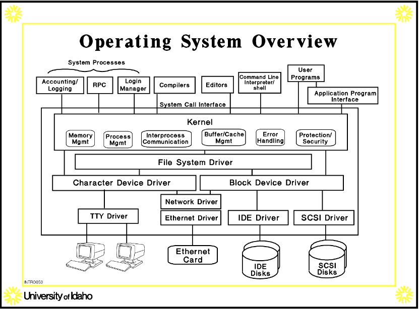

# CS  - System Software

**Date:** 8|26|2025

## Lecture 1: Bruce Bolden 
- Contact: JEB 232 [bruceb@uidaho.edu](mailto:bruceb@uidaho.edu)

### Early Computing – Mainframes
- Input – Punch cards / paper tape
- Output – Paper, magnetic tape
- Storage – Magnetic tape

### Minicomputers
- Input – Terminals
- Output – Paper, disk drives
- Storage – Disk drives (hard or floppy)

### Phones meet Paper tape
- Massimo @Rainmaker1973 [https://x.com/rainmaker1973/status/1957679867035590884]
    A smartphone device brings punched tape back to life. This
    vintage storage method used holes to encode data – now
    modern tech can read it in real time.

### Systems 
- System Structure History Progression:
    - Dumb Terminals/ADM3s/VT100s communicate 30-1000 char/s to a mini computer which has memory and disk
    - X-terminals communicate with Ethernet (at the time 1,000,000) chars/sec to a mini computer which has memory and disk
    - Serial Interfaces(Mouse and keyboard)/Graphics Adapters(moniter) and Disk Controllers (for disk) communicate with the CPU and Memory through a bus (ISA/PCI) 123 MB/s
    - Graphics Adapters(monitor) uses AGP Bus, and through a I/O bridge the Disk/Disk Controller use a PCI Bus/Serial Interfaces(Mouse and keyboard) uses ISA Bus to talk to the CPU, which has a Front-Side bus (132-2000 MB/sec) to the Memory
    - Then they advance to full operating systems; [https://canvas.uidaho.edu/courses/41012/files/folder/Lectures?preview=4419632]
    
## C language
### C vs C++
- Focus: C is procedural and minimal; C++ adds OOP, RAII, and generics.
- Comments: C uses `/* ... */` (and `//` since C99); C++ supports `//` and `/* ... */`.
- Data types: C has primitives; `_Bool` via `<stdbool.h>` in C99. C++ adds `bool`, references, classes.
- Functions: C passes by value; use pointers to modify. C++ also has references and overloading.
- Control flow: `if/switch`, `for/while/do-while` in both.
- Aggregates: C has `struct`, `union`; C++ has `struct`/`class` with methods, constructors, access control.
- Strings: C uses NUL-terminated `char[]`; C++ adds `std::string`.
- Memory: C uses `malloc/calloc/realloc/free`. C++ adds `new/delete` and RAII containers (`std::vector`, `std::unique_ptr`).
- I/O: C uses `<stdio.h>` (`printf/scanf`); C++ uses `<iostream>` (`std::cout/std::cin`). MAY NOT USE READ/WRITE
- Generics: C uses macros/`void*`; C++ has templates.
- Build: C is typically `gcc`, C++ is `g++`. For C headers in C++, prefer `<cstdio>`/`<cstdlib>` namespaced forms.
- Declarations: Old C (C89) requires vars at top of blocks; C99 allows mixed declarations/statements. C++ allows mixed declarations.

#### Function Parameters: pointer (C) vs reference (C++)
```c
// C: swap two ints using pointers
#include <stdio.h>
void swap(int *a, int *b) { int t = *a; *a = *b; *b = t; }
int main(void){ int x=1,y=2; swap(&x,&y); printf("%d %d\n", x,y); }
```
```cpp
// C++: swap using references and overloading
#include <iostream>
void swap(int& a, int& b) { int t = a; a = b; b = t; }
int main(){ int x=1,y=2; swap(x,y); std::cout << x << " " << y << "\n"; }
```

#### Memory Management and Containers
```c
// C: dynamic array with malloc/realloc
#include <stdlib.h>
int *push(int *arr, size_t *n, int v){
    int *p = realloc(arr, (*n + 1) * sizeof *p);
    if(!p) return arr; // handle OOM
    p[(*n)++] = v; return p;
}
```
```cpp
// C++: prefer std::vector (RAII)
#include <vector>
void fill(std::vector<int>& v){ v.push_back(42); }
```

#### Strings and I/O
```c
// C: C-strings and stdio
#include <stdio.h>
int main(void){
    char name[16] = "Ada";
    printf("Hello, %s!\n", name);
}
```
```cpp
// C++: std::string and iostream
#include <iostream>
#include <string>
int main(){
    std::string name = "Ada";
    std::cout << "Hello, " << name << "!\n";
}
```

#### Macros vs Templates
```c
// C: macro for max (no type safety, multiple eval risk)
#define MAX(a,b) ((a) > (b) ? (a) : (b))
```
```cpp
// C++: type-safe template
template <typename T>
T maxT(const T& a, const T& b) { return a > b ? a : b; }
```

#### Structs in C vs C++
```c
// C: struct with data only; must use 'struct' keyword when naming the type
struct Point { int x, y; };
void move(struct Point *p, int dx, int dy){ p->x += dx; p->y += dy; }
```
```cpp
// C++: struct/class can have methods; default access differs (struct=public, class=private)
struct Point { int x{0}, y{0}; void move(int dx,int dy){ x+=dx; y+=dy; } };
```

#### Compiling
```sh
# C
gcc -std=c11 -Wall -Wextra -o app main.c
# C++
g++ -std=c++20 -Wall -Wextra -o app main.cpp
```

## ELF - Relocatable Object File
- ELF (Executable and Linkable Format) file produced by a compiler or assembler but not yet linked into a complete program or shared library.
    - Purpose: Contains code and data that can be combined by the linker (ld) with other relocatable files to form an executable or a shared object.\

## Linux Startup Pseudo Code
```ass
/* crti.o */

_start: 
    call __libc_init_first          /* entry point in .text */
    call _init                      /* startup code in .text*/
    call atexit                     /* startup code in  */
    /* set up arg list for main */
    call main                       /* */
    call _exit                      /* */
```

## static vars can make a program thread unsafe
- strtok() uses a static var
- same readdir
- both of these are not thread safe

## Binary File Formats
- **a.out (assembler output)**
    - file format in older versions of unix for executables, object code, and in later systems, shared-libraries
- **COFF (Common Object File Format)**
    - a spec of  a format for exe, object code, and shared library computer files used on UNIX systems. 
    - "replaced a.out", laid basis for XCOFF, replaced by ELF
- **XCOFF (eXtended COFF)**
- **ELF (Executable and Linking Format)**
    - a primary object format for many OSs including FreeBSD or Linux
    - Three Forms:
        - Executable files (no convention)
        - Relocatable object files (.o)
        - Shared object files (.so, libraries)
- **Mach-O (Mach object file format)**
    - a file format for executables, object code, shared libraries, dynamically loaded code, and core dumps.
    - was more extensibility and faster access to info in the symbol table
    - once used by NeXTSTEP, mac os, and darwin
- **PE (Portable Executable)**
    - executables, object code, DLLs, 32/64 bit versions of windows
    - Portable refers to its versatility
    - needed for the windows OS loader to manage wrapped exe code
    - is used for EXE, DLL, SYS, and others
    - Pe is a modified version of the COFF format

## parts of a.out

- **exec header**
    - only mandatory part
    - contains parameters used by the kernel to load a binary file into memory and exe it
    - the link editor ld needs this info to combine a binary file with other binary files
- **text segment**
    - contains machine code and related data that are loaded into memory when a program executes.
    - May be loaded read-only
- **data segment**
    - Contains initialized data
    - always loaded into writable memory
- **text relocations**
    - Contains records used by the link editor to update pointers in the text segment when combining binary files
- **data relocations**
    - Like the text relocation section, but for data segment pointers.
- **symbol table**
    - Contains records used by the link editor to cross-reference
    the addresses of named variables and functions (symbols)
    between binary files.
- **string table**
    - Contains the character strings corresponding to the symbol
    names.

## ELF

## File Management 
- File management system consists of system utility programs that run as privileged applications
- Input to applications is by means of a file
- Output is saved in a file for long-term storage
## File System Structure
- 
- 
- 

### File Ops
- Create 
- Delete
- Open 
- Close 
- Read 
- Write

### More
- Field
    - Basic element of data
- Record

### File Terminology 
- File
    - Collection of similar records
    - Treated as a single entity 
    - Have file names
    - May restrict access
- Database
    - Collection of related data

### Typical Ops
- Retrieve : r, Insert = i
    - r_all
    - r_one
    - r_next
    - r_previous
    - I_one

### File Management Systems
- The way a user or application may access files
- Programmer does not need to develop file management software

### File Management System Objectives
- Meet the data management needs and requirements of the user
- Guarantee that the data in the file are valid 
- Optimize performance
- Provide I/O support for different device types
- Minimize or eliminate the potential for lost or destroyed data
- Provide a standardized set of I/O interface routines
- Provide I/O support for multiple users

### Minimal set of requirements
- Each user: 
    - should be able to create, delete, read, write, and modify files
    - may have controlled access to other user's files
    - may be able to control the access to their files
    - should be able to restructure the user's files in a form appropriate to the problem
    - should be able to move data between files
    - be able to back up and recover files in case of damage
    - should be able to access the user's files by using symbolic names

## Device Drivers
- Lowest level
- Communicates directly with peripheral devices
- Responsible for starting I/O operations on a device
- Processes the completion of an I/O request

### Basic File System 
- Physical I/O 
- Deals with exchanging blocks of Data
- Concerned with the placement of blocks 
- Concerned with buffering blocks in main memory

### Basic I/O Supervisor
- Responsible for file I/O
- Control structures are maintained
- Concerned with selection of the device on which file I/O is to be performed

### Logical I/O 
- Enables users and applications to access records
- Provides general-purpose record I/O capability
- Mainlines basic data

### Access Method
- Reflect diff file structures
- Diff ways to access and process data

### File Management Functions
- Id and locate a selected File
- Use a directory to describe the location of all files plus their attributes
- On a shared system describe user access control 
- Blocking for access to a file
- Allocate files to free blocks
- manage free storage for available blocks

### Criteria for File Org
- Short access time
    - needed when accessing a single record
    - not needed for batch mode
- Ease of update
    - A file on CD-Rom will not be updated, so this is not a concern
- Economy of storage 
    - should be minimum redundancy in the data
    - Redundancy can be used to speed access such as an index
- Simple maintenance 
- reliability

### File Org
- THE PILE
    - Data is collected in the order they arrive
    - Purpose is to accumulate a mass of data and save it
    - Records may have different fields 
    - No structure
    - Record access is by exhaustive search
    - the Pile is an unordered collection of records. Records are stored as they arrive, one after another, without any particular order or indexing.
- The Sequential File
    - Fixed format used for records
    - Records are the same length
    - all fields the same (order and length)
    - Fields names and length are attributes of the file
    - One field is the key field
        - Uniquely identifies the record
        - Records are stored in key sequence
    - New records are placed in a log file or transaction file
    - Batch update is performed to merge the log file with the master file
- Problems accessing records
    - need to "scan" though file
    - sequential storage proves limited 
        - organize sequential file physically based on keys
- Indexed sequential files
    - Maintain key characteristics of sequential file
        - records organized 
    - two new features
        - index to file to support random access
        - overflow file

- Indexing
    - allows to quickly reach the vicinity of the desired record
        - Contians key field and a pointer to the main file
- sequential vs index sequential
    - say a file contains a million records
    - seq file: on average 500 000 accesses are required to find a record
    - index seq: if and index contains 1000 entires, it will take on average 500 accesses to find the key
- overflow


- Direct or Hashed File
    - Directly accessed a block at a known address
    - Key field required for each record

### Total Five Methods:
- Pile: Good attr handling, records mid, retrieval bad
- Sequential: mid attr handling, records bad, retrieval bad
- Indexed Sequential: bad attr handling, records mid, retrieval mid
- Indexed: mid attr handling, records mid, retrieval mid
- Hashed: bad attr handling, records bad, retrieval mid

### Simple Dir Structure
- List of entires, one for each file
- sequential file with the name of the file serving as the key
- provides no help in organizing the files
- Forces user to be careful not to use the same name for two diff files

### Two-Level scheme for a Directory 
- One dir for each user and a master dir
- master dir contains entry for each user 
    - provides addr and access control info
- Each user dir is a simple list of files for that user
- Still provides no help in structuring collections of files

### Hierarchical, or tree-structured directory
- Master directory with user directories 
- files can be located by following a path from the root, or master, dir down various branches (pathname)
- can have several files with the same file name as long as they have unique path names
- Current dir is working dir
- files are referenced relative to the working dir

### File Sharing
- in a multiuser system, allows files to be shared among users
- issues 
    - access rights
    - management of same time edits

### Access rights 
- None 
    - user may not know it exists
    - User is not allowed to open it
- execution
    - user can load and exe
- Read
    - user can read for any purpose
- Append
    - user can add but not modify or delete
- Update 
    - user can view and edit and delete and add
    - creation or deletion
- Changing protection
    - user can change access rights
- Deletion 
    - user can delete the file
- Owners 
    - has all rights
    - may grant rights by classes
        - user
        - groups
        - all for public

### Simultaneous Access
- User may lock an entire file when updating
- User may lock the individual records during the update 
- Mutual exclusion and deadlock are issues for shared access

### Fixed blocking 
- units of I/O
### Variable Blocking: Unspanned
### Variable Blocking: Spanning

## Networking
- very important
- lots of terms
- many standards and protocols

### Vocab
- LAN - Local Area Network
- VLAN - Virtual LAN
- WAN - Wide Area Network
- bridge
- router
- repeater
- gateway
- OSI Model (Open Systems Interconnection) framework that divides computer network functions into seven distinct layers
- IP - Internet Provider
- TCP - Transmission Control Protocol
- UDP - User Datagram Protocol
- TCP/IP - Protocols used in the internet and other computer networks
- IP address (v4, v6) 32 bit vs 128 bits
- "dotted quad format" represents IPv4, e.g. 000.000.000.000
- URL
- subnet
- netmask
- datagram
- packet
- header
- MAC addresses - Media Access Control Address
- checksum
- DNS - Domain Name System
- NFS - Network File System
- FTP - File transfer Protocol
- telnet
- SSH - Secure Shell 
- SNMP - Simple Network Management Protocol
- SMTP - SImple Mail Transfer Protocol
- ICMP - Internet Control Message Protocol
- DHCP - Dynamic Host Configuration Protocol
- HTTP(s) - Hypertext Transfer Protocol (secure)
- port
- reliable communication
- unreliable communication
- token ring

### basic
- Local area networks (LANs) are defined in terms of the protocol and the topology used for accessing the networking
- The networking protocol is the set of rules established for users to exchange information
- The topology is the network architecture used the interconnect network 
- A token-ring topology is shown in the following figure. In this topology, a "token" (T) is placed in in the data channel
- OSI - open systems interconnect

### TCP/IP
- IEEE/ISO Standards
- High level interface
    - LAN Management 
    - Local bridging 
    - system load protocol

### Client Server
- a server is a system that provides a specific service for the rest of the network
- a client is another system that uses the service
- (DONT HAVE TO BE SEPARATE)

## Servers
- Network file systems
- Remote Printing
- Remote execution
- Name servers
- Terminal servers
- Network-oriented window system

### Layers
- Application layer
- Transport layer
- Internet layer
- Network interface layer

## Interprocess Communication
### Pipes
- An interprocess communication mechanism allowing two or more processes to send information to each other
- Consider: who | wc -l
    - bytes form "who" flow through the pipe into wc -l
    - the -l options on outputs total number of lines in the input
    - both processes run concurrently; pipe buffers and protects against overflow; suspends reader until more data becomes avaible

- Unnamed Pipes
    - sys call: int pipe( int fd[2])
        - pipe() creates an unnamed pipe and returns two file descriptors
        - the descriptor associated with the "read" end of the pipe is stored in fd[0]
        - the descriptor associated with the "write" end of the pipe is stored in fd[1]
        - For example:
        ```C
        int fd[2];
        pipe(fd);
        ```